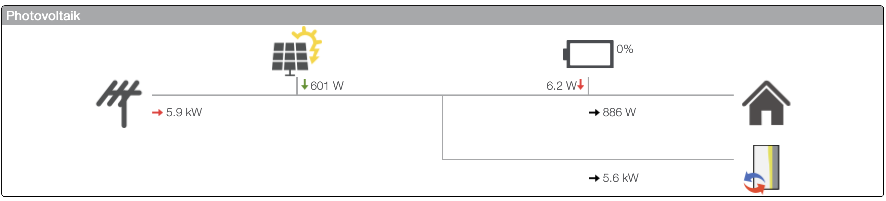
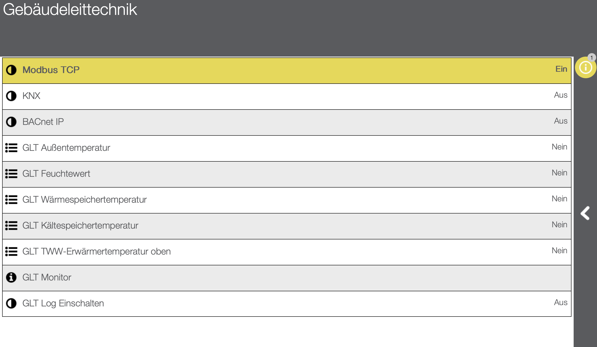

# evcc-to-idm

This is a small script that can be run to forward PV related data from [evcc](https://evcc.io) to an IDM Heatpump. This was tested with a IDM AERO ALM 10-24.



The official Modbus documentation only lists address 74 (PV excess) and 78 (PV total). But it also describes that Smartfox is able to send more data via Modbus. Some searching on GitHub for example [ipump-control](https://github.com/ThomasRgbg/ipump-control) and trying lead to finding the other addresses. 

## Preconditions

1. a running mqtt broker for example [Mosquitto MQTT](https://mosquitto.org)
2. evcc setup to send metrics to mqtt
```
mqtt:
  broker: 192.168.1.124:1883
  topic: evcc
  user: mqtt
  password: password!
```
3. Modbus TCP enabled in IDM Navigator Pro 


## Setup

1. clone the repository
2. run `bundle install`
3. set `MODBUS_HOST`, `MODBUS_PORT` and `MQTT_URL` to your values in `evcc-to-idm.rb`
4. run `bundle exec ruby evcc-to-idm.rb`

To run this continously I have it running in a screen on a raspberry pi that runs other monitoring in my home.

## How does this work

The relevant Modbus registers are: 

- 74 - PV excess power
- 78 - PV total power
- 82 - Home consumption
- 84 - Battery power
- 86 - Battery soc

If only 74/78 are reported a simple UI is shown only listing the PV power. If Battery and home is reported the UI shows all data in a nice graph as shown above. 

The power pulled from the grid is calculated by the navigator software out of all reported values. For this to work it's important to report a 0 for 74 always otherwise the calculation seems to fail and nothing is reported for grid power.